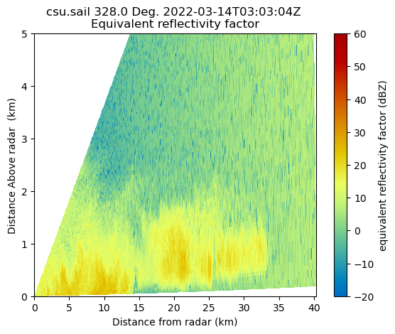
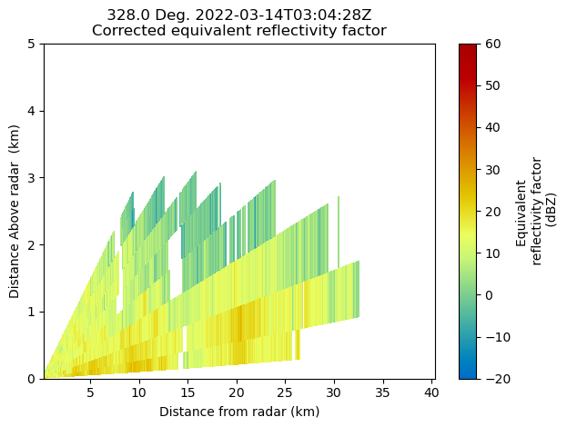

# Py-ART Basics


## Overview
   
Within this notebook, we will cover:

1. General overview of Py-ART and its functionality
1. Reading data using Py-ART
1. An overview of the `pyart.Radar` object
1. Create a Plot of our Radar Data

## Prerequisites
| Concepts | Importance | Notes |
| --- | --- | --- |
| [Cartopy](https://scitools.org.uk/cartopy/docs/latest/) | Helpful | Basic features |
| [Matplotlib ](https://matplotlib.org/) | Helpful | Basic plotting |
| [NumPy ](https://numpy.org/) | Helpful | Basic arrays |

---

## Imports
```python
# import os
import warnings

import cartopy.crs as ccrs
import matplotlib.pyplot as plt
import numpy as np


import pyart

warnings.filterwarnings('ignore')
```
## An Overview of Py-ART

### History of the Py-ART

 * Development began to address the needs of ARM with the acquisition of a number of
   new scanning cloud and precipitation radar as part of the American Recovery Act.
 * The project has since expanded to work with a variety of weather radars and a wider user
   base including radar researchers and climate modelers.
 * The software has been released on GitHub as open source software under a BSD license.
   Runs on Linux, OS X. It also runs on Windows with more limited functionality.

### What can PyART Do?

Py-ART can be used for a variety of tasks from basic plotting to more complex
processing pipelines. Specific uses for Py-ART include:

 * Reading radar data in a variety of file formats.
 * Creating plots and visualization of radar data.
 * Correcting radar moments while in antenna coordinates, such as:
    * Doppler unfolding/de-aliasing.
    * Attenuation correction.
    * Phase processing using a Linear Programming method.
 * Mapping data from one or multiple radars onto a Cartesian grid.
 * Performing retrievals.
 * Writing radial and Cartesian data to NetCDF files.

## Reading in Data Using Py-ART

When reading in a radar file, we use the `pyart.io.read` module.

`pyart.io.read` can read a variety of different radar formats, such as Cf/Radial, LASSEN, and more. 
The documentation on what formats can be read by Py-ART can be found here:

* [Py-ART IO Documentation](https://arm-doe.github.io/pyart/API/generated/pyart.io.html)

For most file formats listed on the page, using `pyart.io.read` should suffice since Py-ART has the ability to automatically detect the file format.

Let's check out what arguments arguments `pyart.io.read()` takes in!

```python
pyart.io.read?
```
```python
Let's use a sample data file from `pyart` - which is [**cfradial** format](https://github.com/NCAR/CfRadial).

When we read this in, we get a [`pyart.Radar` object](https://arm-doe.github.io/pyart/API/generated/pyart.core.Radar.html#pyart.core.Radar)!
```
```python
file = '../data/sample_sail_ppi.nc'
radar = pyart.io.read(file)
radar
```
### Investigate the [`pyart.Radar` object](https://arm-doe.github.io/pyart/API/generated/pyart.core.Radar.html#pyart.core.Radar)

This is where data such as reflectivity and velocity are stored.

To see what fields are present we can add the fields and keys additions to the variable where the radar object is stored.

```python
radar.fields.keys()
```

```python
dict_keys(['corrected_velocity', 'corrected_reflectivity', 'corrected_differential_reflectivity', 'corrected_specific_diff_phase', 'corrected_differential_phase'])
```

### Extract a sample data field

The fields are stored in a dictionary, each containing coordinates, units and more. All can be accessed by just adding the fields addition to the radar object variable.

For an individual field, we add a string in brackets after the fields addition to see the contents of that field.

Let’s take a look at `corrected_reflectivity`, which is a common field to investigate.
```python
print(radar.fields['corrected_reflectivity'])
```
```python
# Output
{'_FillValue': 1e+20, 'long_name': 'Corrected reflectivity', 'units': 'dBZ', 'standard_name': 'corrected_equivalent_reflectivity_factor', 'coordinates': 'elevation azimuth range', 'data': masked_array(
  data=[[--, --, --, ..., --, --, --],
        [--, --, --, ..., --, --, --],
        [--, --, --, ..., --, --, --],
        ...,
        [12.25, 9.84000015258789, 14.210000038146973, ..., --, --, --],
        [11.5, 9.729999542236328, 11.75999927520752, ..., --, --, --],
        [11.069999694824219, 10.329999923706055, 10.050000190734863, ...,
         --, --, --]],
  mask=[[ True,  True,  True, ...,  True,  True,  True],
        [ True,  True,  True, ...,  True,  True,  True],
        [ True,  True,  True, ...,  True,  True,  True],
        ...,
        [False, False, False, ...,  True,  True,  True],
        [False, False, False, ...,  True,  True,  True],
        [False, False, False, ...,  True,  True,  True]],
  fill_value=1e+20)}
```

We can go even further in the dictionary and access the actual reflectivity data.

We use add <span style="color:#dc3593"> data </span>  at the end, which will extract the data array (which is a masked numpy array) from the dictionary.

```python
reflectivity = radar.fields['corrected_reflectivity']['data']
print(type(reflectivity), reflectivity)
```
Lets’ check the size of this array…

```python
reflectivity.shape
```
```python
# Output
9013 668
```
This reflectivity data array, numpy array, is a two-dimensional array with dimensions:

  - Gates (number of samples away from the radar)

  -  Rays (direction around the radar)

```python
print(radar.nrays, radar.ngates)
```

```python
#Output
9013 668
```
If we wanted to look the 300th ray, at the second gate, we would use something like the following:

```python
print(reflectivity[300, 2])
```
```python
9.369999885559082
```

### Plotting our Radar Data
#### An Overview of Py-ART Plotting Utilities

Now that we have loaded the data and inspected it, the next logical thing to do is to visualize the data! Py-ART’s visualization functionality is done through the objects in the pyart.graph module.

In Py-ART there are 4 primary visualization classes in pyart.graph:
 
  - [RadarDisplay](https://arm-doe.github.io/pyart/API/generated/pyart.graph.RadarDisplay.html)
  - [RadarMapDisplay](https://arm-doe.github.io/pyart/API/generated/pyart.graph.RadarMapDisplay.html)
  - [AirborneRadarDisplay](https://arm-doe.github.io/pyart/API/generated/pyart.graph.AirborneRadarDisplay.html)

Plotting grid data

  - [GridMapDisplay](https://arm-doe.github.io/pyart/API/generated/pyart.graph.GridMapDisplay.html)

### Use the RadarMapDisplay with our data

For the this example, we will be using RadarMapDisplay, using Cartopy to deal with geographic coordinates.

We start by creating a figure first.

```python
fig = plt.figure(figsize=[10, 10])
```
```python
#Output
<Figure size 1000x1000 with 0 Axes>
```

Once we have a figure, let’s add our `RadarMapDisplay`

```python
fig = plt.figure(figsize=[10, 10])
display = pyart.graph.RadarMapDisplay(radar)
```

```python
<Figure size 1000x1000 with 0 Axes>
```

Adding our map display without specifying a field to plot won’t do anything we need to specifically add a field to field using `.plot_ppi_map()`, which creates a Plan Position Indicator (PPI) plot.

```python
display.plot_ppi_map('corrected_reflectivity')
```


By default, it will plot the elevation scan, the the default colormap from Matplotlib… let’s customize!

We add the following arguements:

  - **`sweep=3`** - The fourth elevation scan (since we are using Python indexing)

  - `vmin=-20` - Minimum value for our plotted field/colorbar

  - `vmax=60` - Maximum value for our plotted field/colorbar

  - `projection=ccrs.PlateCarree()` - Cartopy latitude/longitude coordinate system

  - `cmap='pyart_HomeyerRainbow'` - Colormap to use, selecting one provided by PyART of

  - `lat_lines` - Which lines to plot for latitude

  - `lon_lines` - Which liens to plot for longitude


```python


###### fig = plt.figure(figsize=[12, 8])
display = pyart.graph.RadarMapDisplay(radar)
display.plot_ppi_map('corrected_reflectivity',
                     sweep=3,
                     vmin=-20,
                     vmax=60,
                     lat_lines = np.arange(38, 39.5, .25),
                     lon_lines = np.arange(-107.5, -106.5, .25),
                     projection=ccrs.PlateCarree(),
                     cmap='pyart_HomeyerRainbow')
plt.show()

```


You can change many parameters in the graph by changing the arguments to plot_ppi_map. As you can recall from earlier. simply view these arguments in a Jupyter notebook by typing:

```python
display.plot_ppi_map?
```

For example, let’s change the colormap to something different

```python
fig = plt.figure(figsize=[12, 8])
display = pyart.graph.RadarMapDisplay(radar)
display.plot_ppi_map('corrected_reflectivity',
                     sweep=3,
                     vmin=-20,
                     vmax=60,
                     projection=ccrs.PlateCarree(),
                     lat_lines = np.arange(38, 39.5, .25),
                     lon_lines = np.arange(-107.5, -106.5, .25),
                     cmap='pyart_Carbone42')
plt.show()
```


Or, let’s view a different elevation scan! To do this, change the sweep parameter in the plot_ppi_map function.

```python
fig = plt.figure(figsize=[12, 8])
display = pyart.graph.RadarMapDisplay(radar)
display.plot_ppi_map('corrected_reflectivity',
                     sweep=6,
                     vmin=-20,
                     vmax=60,
                     lat_lines = np.arange(38, 39.5, .25),
                     lon_lines = np.arange(-107.5, -106.5, .25),
                     projection=ccrs.PlateCarree(),
                     cmap='pyart_Carbone42')
plt.show()
```


## Plotting an RHI

Another common plot that is requested by the radar community is a Range Height Indicator (RHI) Plot.

Fortunately, `Py-ART` has a utility to help us create one of these from our radar!
During this same time period during SAIL, the ARM program collected RHI scans, which provide a vertical cross section through the preciptiation! Let’s read in one of those files. The IO line is the same!
#### Read in an RHI file

```python
rhi_file = '../data/sample_sail_rhi.nc'
rhi_radar = pyart.io.read(rhi_file)
```
#### Plot our RHI
We want to use the `RadarDisplay` here to visualize, using the reflectivity field (`DBZ`)

Note - this is uncorrected data, so be sure take caution working with this

```python
radar = pyart.graph.RadarDisplay(rhi_radar)
radar.plot("DBZ", vmin=-20, vmax=60,)
plt.ylim(0, 5);
```



#### Add a “Pseudo-RHI” from our PPI data

But let’s say we wanted to compare the vertical resolution we get from an RHI, compared to PPI… we can do this with Py-ART!

```python
# Load our PPI data back in
file = '../data/sample_sail_ppi.nc'
radar = pyart.io.read(file)
radar

# Create a cross section at our 334 degree azimuth
xsect = pyart.util.cross_section_ppi(radar, [328])
```
Now, notice how coarse the resolution of the precipitation region!

```python
colorbar_label = 'Equivalent \n reflectivity factor \n (dBZ)'
display = pyart.graph.RadarDisplay(xsect)
display.plot('corrected_reflectivity', 0, vmin=-20, vmax=60, colorbar_label=colorbar_label)
plt.ylim(0, 5)
plt.tight_layout()
```



???+ note

    Py-ART can be used for a variety of tasks from basic plotting to more complex
    processing pipelines. Specific uses for Py-ART include:


🎉 CONGRATULATIONS ! 🎉

